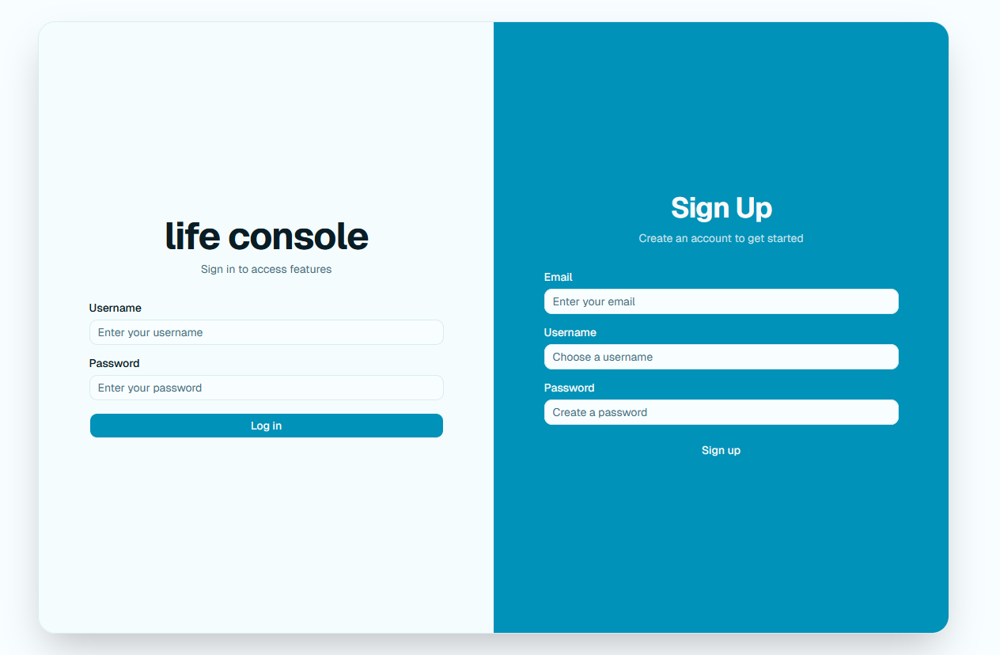
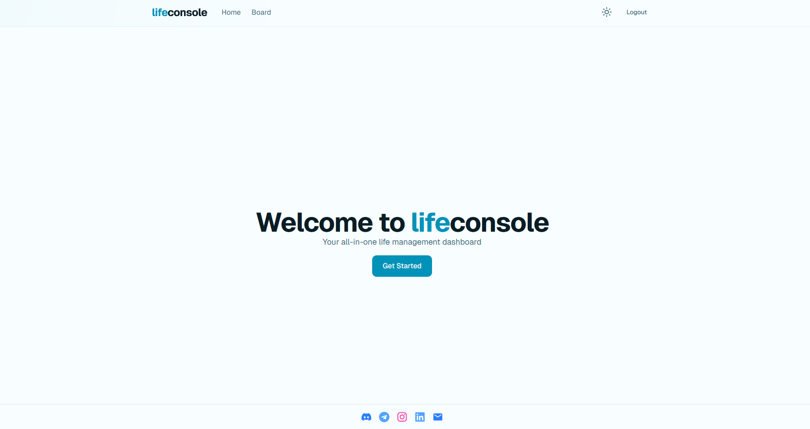
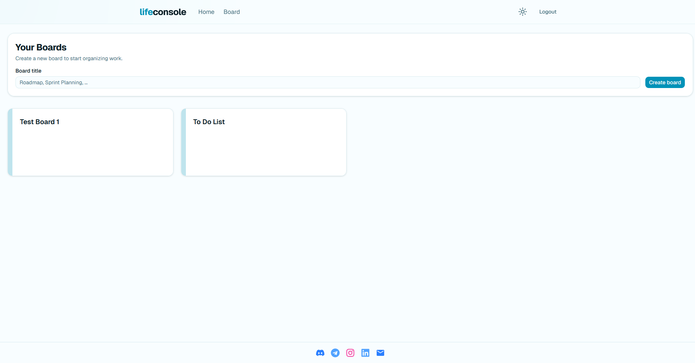
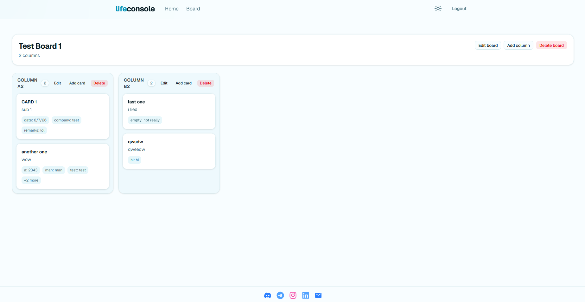
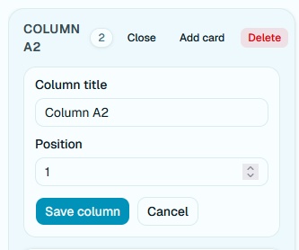
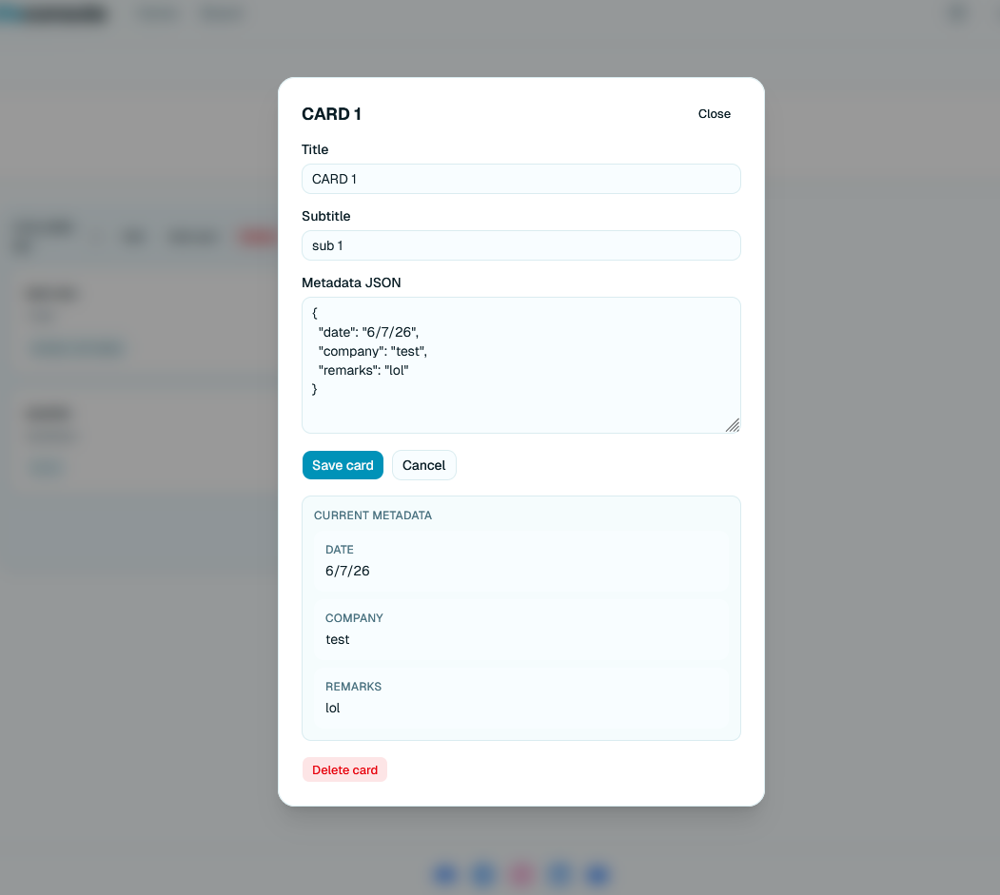

# Life Console User Guide

## Overview

Life Console is a application where you can organize information into a board > column > card hierachical structure to better .

## Getting Started

1. Open the application in your browser.
2. Sign up for a new account or log in with an existing account.
3. Use the navbar to move between the available pages.

## Main Navigation

The navbar currently includes links and buttons to the main pages of the app.

- Home
- Board
- Dark mode toggle
- Login/Logout

## Authentication

### Sign Up/Log In

Use the correct form to either create a new account or access an existing account.

### Log Out

Select the logout option in the navbar to end the current session and return to the login page.

## Home Page

The home page acts as the landing page after authentication. Before logging in, the "Getting Started" button redirects users to the login page. After logging in, the button redirects you to the boards feature page.

## Board Feature

The board area is the main workspace for organizing tasks.

### Create a New Board

Use the board creation flow to make a new board.

### Navigate to a Board

After creating a board, select it from the board list to open it.

### Board Management

Boards support basic CRUD actions:

- Create boards
- View boards (Displayed as is)
- Update boards
- Delete boards

## Columns

Each board can contain columns to group work items.

Columns support basic CRUD actions:

- Create columns
- View columns (Displayed as is)
- Update columns

- Delete columns

## Cards

Cards represent individual items inside a column.

Cards support basic CRUD actions:

- Create cards
- View cards
  - Metadata displayed is limited to 3 on card display
  - Clicking on individual cards opens a modal with full details of the card

- Update cards
- Delete cards

## Notes

- Currently, card metadata can only be inputted in a valid JSON format. Should ideally be changed to a more user friendly format in the future
