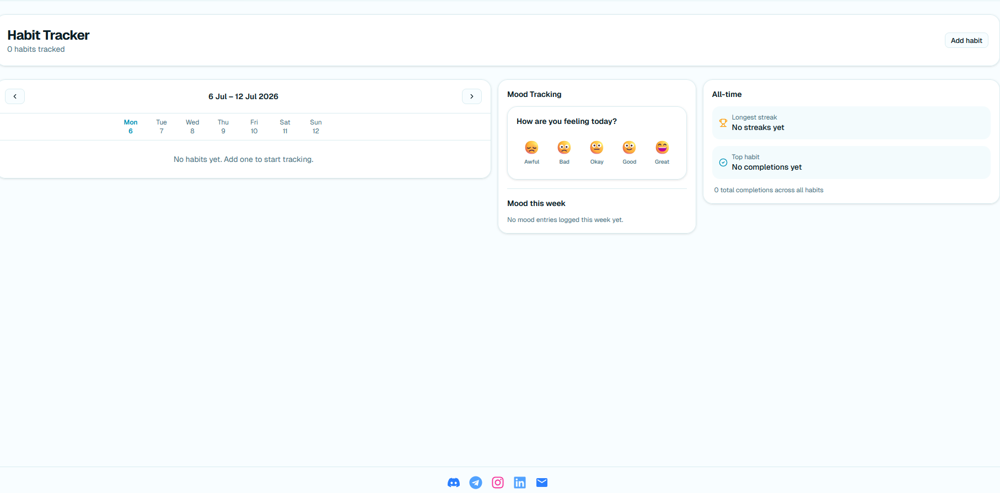
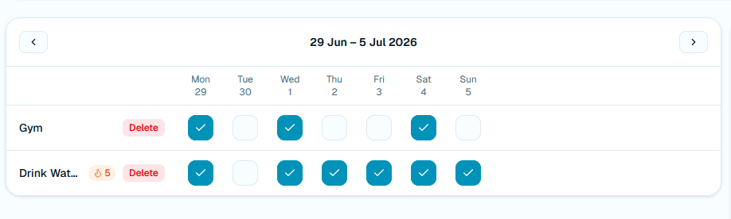
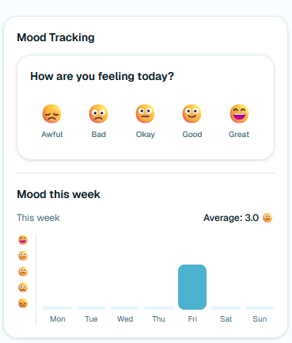
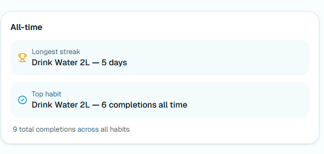

# Life Console User Guide

## Overview

Life Console is a application with multiple features

- Organize infomation in a kanban style hierachical structure
- Track daily habits and mood with an accompanying statistics dashboard

## Getting Started

1. Open the application in your browser.
2. Sign up for a new account or log in with an existing account.
3. Use the navbar to move between the available pages.

## Main Navigation

The navbar currently includes links and buttons to the main pages of the app.

- Home
- Board
- Dark mode toggle
- Login/Logout

## Authentication

### Sign Up/Log In

Use the correct form to either create a new account or access an existing account.

### Log Out

Select the logout option in the navbar to end the current session and return to the login page.

## Home Page

The home page acts as the landing page after authentication. Before logging in, the "Getting Started" button redirects users to the login page. After logging in, the button redirects you to the boards feature page.

## Board Feature

The board area is the main workspace for organizing tasks.

### Create a New Board

Use the board creation flow to make a new board.

### Navigate to a Board

After creating a board, select it from the board list to open it.

### Board Management

Boards support basic CRUD actions:

- Create boards
- View boards (Displayed as is)
- Update boards
- Delete boards

### Columns

- Each board can contain columns to group work items
- Columns can be dragged and dropped for easier rearrangment

Columns support basic CRUD actions:

- Create columns
- View columns (Displayed as is)
- Update columns
- Delete columns

### Cards

- Cards represent individual items inside a column
- Cards can be dragged and dropped within and also across columns

Cards support basic CRUD actions:

- Create cards
- View cards
  - Metadata displayed is limited to 3 on card display
  - Clicking on individual cards opens a modal with full details of the card

- Update cards
- Delete cards

## Habit Tracker feature

The habit tracker page features a dashboard allowing habit tracking by the week, alongside a mood picker and an all-time statistics display

### Habit tracking

Add multiple habits you wish to track via the `Add habit` button located at the top right of the page

- habits are displayed in order of creation with checkboxes to mark completion on a weekly basis
- Streaks indicate consecutive completions for each habit

### Mood tracking

You can select a mood that best represents your day via the mood picker; a weekly summary of how your week has been is visualised via a bar chart

### Habit statistics

Statistics for all habit completions are aggregated and computed and displayed
Current statistics available:

- Total completions across all habits
- Longest streak
- Top habit

